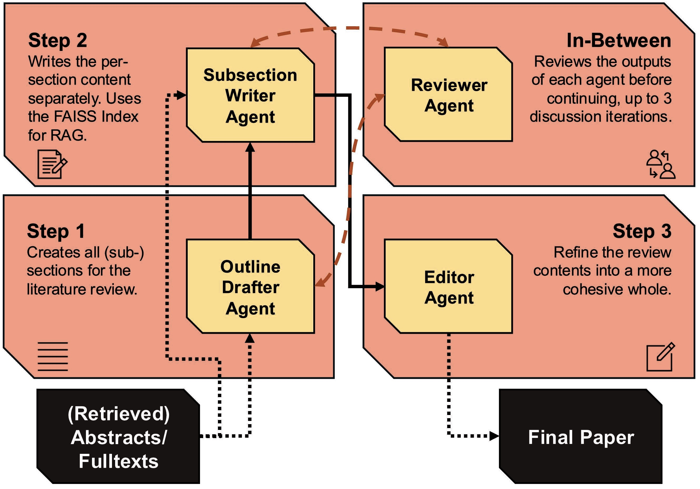

# **Agentic Workflow for Automated Literature Review Writing** ⚙️

This is the repository for the "Agentic Workflow for Automated Literature Review Writing" project.
Note that all scripts have a `.bash` or `.py` version (`.py` scripts have no `.bash` version), which can all be found [here](scripts).
In addition, adjusting any configurations for the code can be done via the configs [here](configs).

# **The System Name**

The main system proposed here is called `LiRA`, which has several meanings:
1. It is an abbreviation of the phrase "**Li**terature **R**eview **A**gents"
2. In terms of etymology, the term "lira" has roots in the term "libra." This signifies the following connections:
    - The libra in astrology is represented by the scale, the symbol of balance. `LiRA` attempts to balance the contributions each agent provides to the final resulting review.
    - Both the "lira" and "libra" are/were symbols of value (currencies) in several civilizations (i.e., Italy, Turkey, Israel, Ancient Rome). This symbolizes a major goal of `LiRA`, which is to provide value to the user in terms of knowledge.




## **Setup**

This repository was built using `Python 3.10.4`. Also, *ensure that you have sufficient disk space (~12GB) and CPU Memory (mainly for ROUGE evaluation, as it requires ~26GB to run) if you want to run all experiments*, as the necessary intermediate files are saved and the dataset files are quite large.
To setup this repository, simply run the following:

```sh

git clone https://github.com/elsevier-research/ds-automated-lit-review.git
cd ds-automated-lit-review

# Install after creating an environment
pip install -r requirements.txt

# Or if using conda, install the `.yaml` directly
conda env create -f environment.yaml

```

> [!IMPORTANT]
> Because the repository currently requires the SpaCy transformers and sciSpacy large model, these lines also needs to be run:
> 
>   ```sh
>   
>   pip install https://s3-us-west-2.amazonaws.com/ai2-s2-scispacy/releases/v0.5.4/en_core_sci_lg-0.5.4.tar.gz
>   
>   ```
> 
> On top of this, there are potential issues that may occur due to `sciSpacy` requiring `nmslib`. See [here](https://github.com/allenai/scispacy?tab=readme-ov-file#installation-note-nmslib) for more details. 
> Other potential issues may occur due to the below packages:
> 1. **VLLM:** This package requires CUDA and Linux to run, with the results reported in this project coming specifically from the conda version. See [here](https://docs.vllm.ai/en/v0.5.5/getting_started/installation.html) for more info. 
> 2. **Faiss:** It may occur that `faiss_gpu` or `faiss_cpu` does not show up as installable packages when running `pip install` (for Linux and MacOS). As a workaround, consider using `faiss` or one of its variations (i.e., `faiss-gpu-cu12` for CUDA-12 systems) instead.

> [!NOTE]
> If you aim to replicate the reported results, then do note that for settings which utilized `gemma3:4b`, the device used was a `g5.2xlarge` from AWS, which themselves have` NVIDIA A10G Tensor Core` GPUs. This GPU type has a compute capability score of 8.6, which fulfills the `fp8-quantization` requirement of 7.5.

### **Datasets**

The datasets used for this project include an internal (private; only accessible via the project page which also contain *instructions on how to handle it*) and external (SciReviewGen) dataset. The external one can be downloaded using the following script:

```sh

python scripts/download_srg.py

```

This also includes an automatic download of all the metadata from Semantic Scholar for referencing, as the SciReviewGen dataset does not have this on its own. Simply adjust the seed and number of samples to customize the proportion of the data to use. Do keep in mind that this value needs to be adjusted for all configuration files.

The data entries may need to be cleaned beforehand (for example, to remove the word "Abstract" from the beginning, formatting the table to match the determined format). This can be performed by running the following script:

```sh

python scripts/clean_data.py

```


### **Local Model**

Some experimental settings (for the main workflow only) require the use of `ollama` as an alternative model. To install it, simply go [here](https://ollama.com/download) and follow the instructions present there. Then, simply run the following (requires additional memory depending on the model specified):

```sh

# To download the model
# (This can be any model available on ollama, though it's recommended to use a model with a larger context window)
ollama run gemma3:4b

# By default, ollama has a context window of 2-4k tokens. To increase this, simply perform the below steps in the ollama chat terminal:
# Set the context window to 128k tokens
/set parameter num_ctx 128000

# Then save the model using a new name (i.e., `gemma3:4b_128k`)
/save gemma3:4b_128k

# Exit and then load the new model
/exit
ollama run gemma3:4b_128k

```

Once this has been done, you can now perform the local model experiments! Just make sure ollama is running the correct model in the background.

### **Remote Model**

For the remote model, `AzureOpenAI` is utilised, meaning an API and several other configurations are necessary. Please set the following variables in your environment to get started with the remote models:

```sh

# For macOS/Linux
# Temporarily (only lasts in current terminal session)
export AZURE_OPENAI_URL_BASE="[YOUR_URL_BASE]"
export AZURE_OPENAI_API_VERSION="[YOUR_API_VERSION]"
export AZURE_OPENAI_API_KEY="[YOUR_ORGANIZATION_KEY]"

# Permanently
# Add the following lines to your ~/.bash_profile file
echo 'export AZURE_OPENAI_URL_BASE="[YOUR_URL_BASE]"'
echo 'export AZURE_OPENAI_API_VERSION="[YOUR_API_VERSION]"'
echo 'export AZURE_OPENAI_API_KEY="[YOUR_ORGANIZATION_KEY]"'

# For Windows
set AZURE_OPENAI_URL_BASE="[YOUR_URL_BASE]"
set AZURE_OPENAI_API_VERSION="[YOUR_API_VERSION]"
set AZURE_OPENAI_API_KEY="[YOUR_ORGANIZATION_KEY]"

```

## **Running**

### **Reference Baselines**

For comparison with the baseline methods, please run the following:

```sh

# For the naive and MASS-Survey baseline
# Be sure to adjust the method to `base` and `mass` respectively
# in the `baseline_mass.yaml` file.
python run_baseline_mass.py

# For the AutoSurvey baseline
python run_autosurvey.py

```

> [!NOTE]
> It may be the case that a few articles do not get generated due to slight issues with the AzureOpenAI API. 
> In those cases (which you can easily spot in the article table for each experiment), simply delete the article and rerun the generation script.
> Also, for running the *citation quality evaluation*, database files are needed. These can be created by running the AutoSurvey experiment with `db_only` set to `True` in the configuration file.

For clarity, the following folders will be where you should look for certain files (if the configurations are not adjusted):
1. [Articles](articles) is where all experiments save their resulting articles by default. 
2. [Data](data) is where all the data is stored to and read from by default. 
3. [Results](results) is where all the results are stored by default.

> [!TIP]
> As the main scripts utilize `hydra`, you can override arguments in the terminal by providing them in the following form:
> 
>   ```sh
>   
>   # Provide the group header name (always `base`) and then the arguments as a dictionary
>   python run_baseline_mass.py '+base={method: mass}'
>   
>   ```

### **Our Method**

To run and evaluate our method, simply run:

```sh

python main.py

```

For an easy overview of all results, run the below script:

```sh

python scripts/aggregate_results.py

```

This returns all the results as a `.csv` file by default in the `results` folder.

## **Licenses**

The SciReviewGen dataset is released under [CC BY-NC 4.0](https://creativecommons.org/licenses/by-nc/4.0/). Furthermore, SciReviewGen is created based on the Semantic Scholar Open Research Corpus (S2ORC), which is released under the [ODC-By 1.0](https://opendatacommons.org/licenses/by/1-0/) License.

## **Citation**

It is advised to cite the papers adapted for this repository and project via the citations below:

```bibtex

# Semantic Scholar API
@article{Kinney2023TheSS,
    title={The Semantic Scholar Open Data Platform},
    author={Rodney Michael Kinney and Chloe Anastasiades and Russell Authur and Iz Beltagy and Jonathan Bragg and Alexandra Buraczynski and Isabel Cachola and Stefan Candra and Yoganand Chandrasekhar and Arman Cohan and Miles Crawford and Doug Downey and Jason Dunkelberger and Oren Etzioni and Rob Evans and Sergey Feldman and Joseph Gorney and David W. Graham and F.Q. Hu and Regan Huff and Daniel King and Sebastian Kohlmeier and Bailey Kuehl and Michael Langan and Daniel Lin and Haokun Liu and Kyle Lo and Jaron Lochner and Kelsey MacMillan and Tyler C. Murray and Christopher Newell and Smita R Rao and Shaurya Rohatgi and Paul Sayre and Zejiang Shen and Amanpreet Singh and Luca Soldaini and Shivashankar Subramanian and A. Tanaka and Alex D Wade and Linda M. Wagner and Lucy Lu Wang and Christopher Wilhelm and Caroline Wu and Jiangjiang Yang and Angele Zamarron and Madeleine van Zuylen and Daniel S. Weld},
    journal={ArXiv},
    year={2023},
    volume={abs/2301.10140},
    url={https://api.semanticscholar.org/CorpusID:256194545}
    }

# SciReviewGen Data
@inproceedings{kasanishi-etal-2023-scireviewgen,
    title = "{S}ci{R}eview{G}en: A Large-scale Dataset for Automatic Literature Review Generation",
    author = "Kasanishi, Tetsu  
    and Isonuma, Masaru
    and Mori, Junichiro
    and Sakata, Ichiro",
    editor = "Rogers, Anna
    and Boyd-Graber, Jordan
    and Okazaki, Naoaki",
    booktitle = "Findings of the Association for Computational Linguistics: ACL 2023",
    month = jul,
    year = "2023",
    address = "Toronto, Canada",
    publisher = "Association for Computational Linguistics",
    url = "https://aclanthology.org/2023.findings-acl.418/",
    doi = "10.18653/v1/2023.findings-acl.418",
    pages = "6695--6715",
}

# STORM-Code
@inproceedings{shao2024assisting,
    title={{Assisting in Writing Wikipedia-like Articles From Scratch with Large Language Models}}, 
    author={Yijia Shao and Yucheng Jiang and Theodore A. Kanell and Peter Xu and Omar Khattab and Monica S. Lam},
    year={2024},
    booktitle={Proceedings of the 2024 Conference of the North American Chapter of the Association for Computational Linguistics: Human Language Technologies, Volume 1 (Long and Short Papers)}
}

# MASS-Code
@InProceedings{qi2025generation,
    author="Qi, Ruihua
    and Li, Weilong
    and Lyu, Haobo",
    editor="Wong, Derek F.
    and Wei, Zhongyu
    and Yang, Muyun",
    title="Generation of Scientific Literature Surveys Based on Large Language Models (LLM) and Multi-Agent Systems (MAS)",
    booktitle="Natural Language Processing and Chinese Computing",
    year="2025",
    publisher="Springer Nature Singapore",
    address="Singapore",
    pages="169--180",
    isbn="978-981-97-9443-0"
}

# AutoSurvey Code
@InProceedings{2024autosurvey,
    title={AutoSurvey: Large Language Models Can Automatically Write Surveys},
    author = {Wang, Yidong and Guo, Qi and Yao, Wenjin and Zhang, Hongbo and Zhang, Xin and Wu, Zhen and Zhang, Meishan and Dai, Xinyu and Zhang, Min and Wen, Qingsong and Ye, Wei and Zhang, Shikun and Zhang, Yue},
    booktitle={The Thirty-eighth Annual Conference on Neural Information Processing Systems},
    year={2024}
}

```