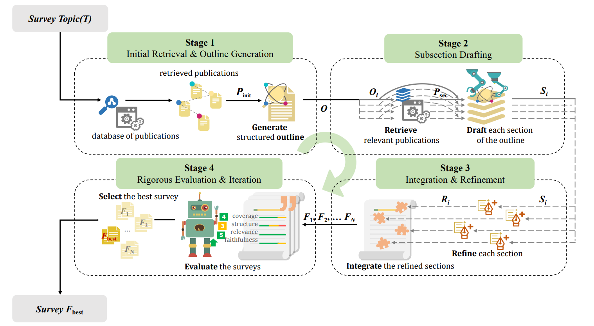
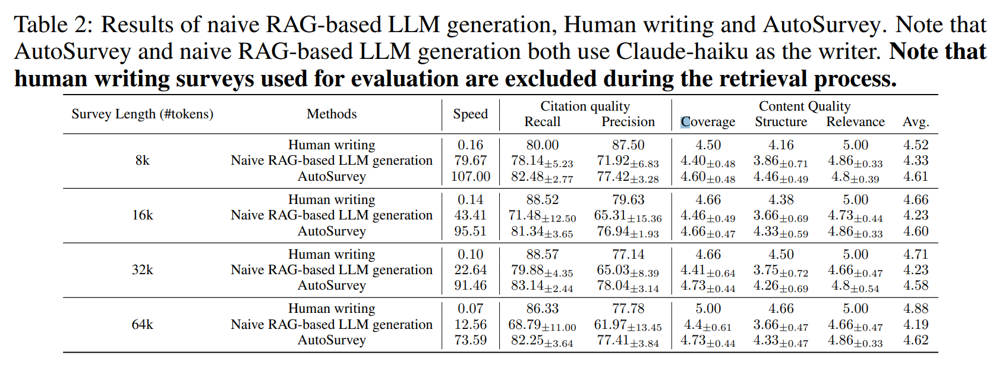

# AutoSurvey (NeurIPS 2024)
<p align="center">
   <a href="https://arxiv.org/abs/2406.10252">AutoSurvey: Large Language Models Can Automatically Write Surveys</a>
</p>
<p align="center">
  <strong></strong><br>
  Yidong Wang<sup>1,2∗</sup>, Qi Guo<sup>2,3∗</sup>, Wenjin Yao<sup>2</sup>, Hongbo Zhang<sup>1</sup>, Xin Zhang<sup>4</sup>, Zhen Wu<sup>3</sup>, Meishan Zhang<sup>4</sup>, Xinyu Dai<sup>3</sup>, Min Zhang<sup>4</sup>, Qingsong Wen<sup>5</sup>, Wei Ye<sup>2†</sup>, Shikun Zhang<sup>2†</sup>, Yue Zhang<sup>1†</sup>
  <br><br>
  <strong></strong><br>
  <sup>1</sup>Westlake University, <sup>2</sup>Peking University, <sup>3</sup>Nanjing University, <sup>4</sup>Harbin Institute of Technology, Shenzhen, <sup>5</sup>Squirrel AI
</p>

> [!NOTE]
> The contents of this repository and README have been adapted to better suit the current project's needs.

## Introduction

AutoSurvey is a speedy and well-organized framework for automating the creation of comprehensive literature surveys.


Extensive experimental results across different survey lengths (8k, 16k, 32k, and 64k tokens) demon-
strate that AutoSurvey consistently achieves high citation and content quality scores



## Requirements

- Python 3.10.x
- Required Python packages listed in `requirements.txt`

## Installation

1. Clone the repository:
   ```sh
   git clone https://github.com/AutoSurveys/AutoSurvey.git
   cd AutoSurvey
   ```

2. Install the required packages:
   ```sh
   pip install -r requirements.txt
   ```

3. Download the database: (Here we provide a database containing 530,000 arXiv paper abstracts and all papers are under the CS category. You can contact [us](mailto:qguo@smail.nju.edu.cn) to obtain the database containing the full content of the papers. )
   https://1drv.ms/u/c/8761b6d10f143944/EaqWZ4_YMLJIjGsEB_qtoHsBoExJ8bdppyBc1uxgijfZBw?e=2EIzti
   ```sh
   unzip database.zip -d ./database/
   ```

## Usage

### Generation
Here is an example command to generate survey on the topic "LLMs for education":

```sh
python autosurvey_main.py --topic "LLMs for education" 
                          --gpu 0
                          --save_dir ./output/
                          --model gpt-4o-2024-05-13
                          --section_num 7
                          --subsection_len 700
                          --rag_num 60
                          --outline_reference_num 1500
                          --db_dir ./database
                          --embedding_model nomic-ai/nomic-embed-text-v1
```

The generated content will be saved in the `./output/` directory.

- `--gpu`: Specify the GPU to use (NOTE: not available for a good number of macOS systems!).
- `--save_dir`: Directory to save the output survey.
- `--model`: Model to use.
- `--topic`: Topic to generate content for.
- `--section_num`: Number of sections in the outline.
- `--subsection_len`: Length of each subsection.
- `--rag_num`: Number of references to use for RAG.
- `--outline_reference_num`: Number of references for outline generation.
- `--db_dir`: Directory of the database.
- `--embedding_model`: Embedding model for retrieval.


> [!NOTE]
> Apparently for macOS, a segmentation issue exists relating to some Python extensions (being written in C) and threading, mainly with the OpenMP library (either compatibility issues for certain macOS versions or over-allocation of memory. This may need to be investigated further, but most likely the latter is the cause).
> 
> To solve this, you can limit the number of threads OpenMP uses by doing:
> 
>   ```sh
>
>    export OMP_NUM_THREADS=1
>    export MKL_NUM_THREADS=1
> 
>    ```
> 
> If this doesn’t work, perhaps you can try compiling the OpenMP reliant packages with `gcc`:
>
>   ```sh
>
>   brew install gcc
>   pip install —force-reinstall —no-binary :all: lumpy
>
>   ```

### Evaluation

Here is an example command to evaluate the generated survey on the topic "LLMs for education":

```sh
python evaluation.py --topic "LLMs for education" 
               --gpu 0
               --save_dir ./output/
               --model gpt-4o-2024-05-13
               --db_dir ./database
               --embedding_model nomic-ai/nomic-embed-text-v1
               --api_url https://api.openai.com/v1/chat/completions
               --api_key sk-xxxxxx 
```

Make sure the generated survey is in the `./output/` directory

The evaluation result will be saved in the `./output/` directory.

- `--gpu`: Specify the GPU to use (default: '0').
- `--save_dir`: Directory to save the evaluation results (default: './output/').
- `--model`: Model for evaluation.
- `--topic`: Topic of generated survey.
- `--db_dir`: Directory of the database.
- `--embedding_model`: Embedding model for retrieval.
- `--api_key`: API key for the model.
- `--api_url`: url for API request.


## Citing Autosurvey

Please cite us if you find this project helpful for your project/paper:

```
@inproceedings{
2024autosurvey,
title={AutoSurvey: Large Language Models Can Automatically Write Surveys},
author = {Wang, Yidong and Guo, Qi and Yao, Wenjin and Zhang, Hongbo and Zhang, Xin and Wu, Zhen and Zhang, Meishan and Dai, Xinyu and Zhang, Min and Wen, Qingsong and Ye, Wei and Zhang, Shikun and Zhang, Yue},
booktitle={The Thirty-eighth Annual Conference on Neural Information Processing Systems},
year={2024}
}
```

## Contributing

Contributions are welcome! Please open an issue to discuss what you would like to change.

## License

This project is licensed under the MIT License.
